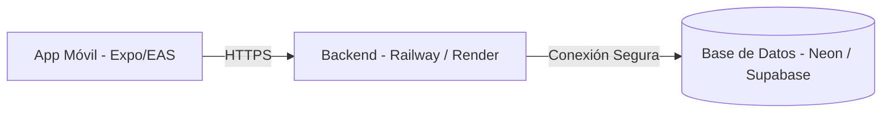
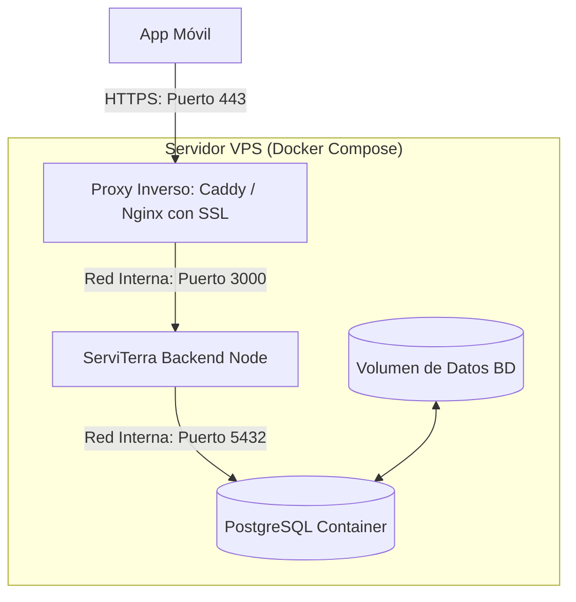
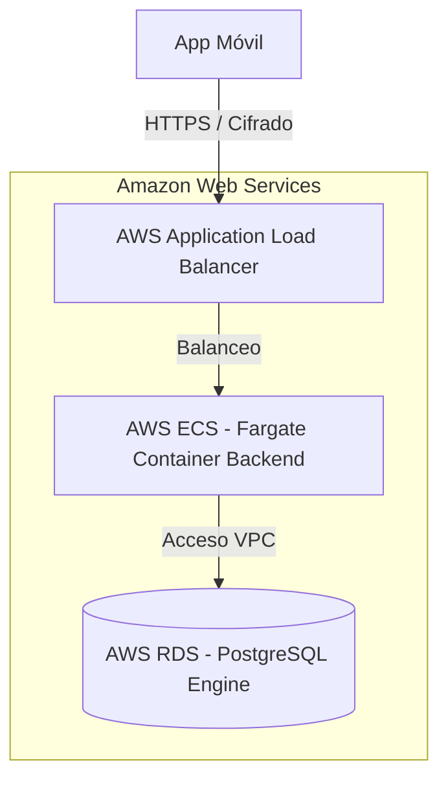
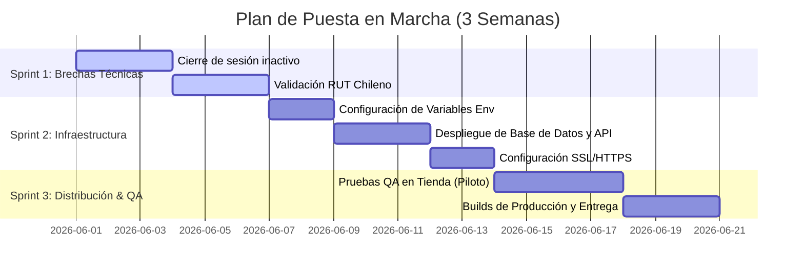

# 🚛 Propuesta Técnica y Diagnóstico de Estado
## Sistema de Gestión y Control de Colaciones — **ServiTerra Colación**

Este documento presenta una descripción completa del estado actual del sistema **ServiTerra Colación**, detalla las funcionalidades implementadas, define las brechas técnicas necesarias para que el sistema esté operativo al 100% en producción y propone tres alternativas de despliegue según las necesidades presupuestarias y operativas del cliente.

---

## 1. Resumen Ejecutivo

**ServiTerra Colación** es una solución tecnológica diseñada para mitigar pérdidas financieras y optimizar el control de beneficios de colación entregados a transportistas. El sistema centraliza e intercepta los registros en tiempo real en los diversos puntos de atención, garantizando que la empresa pague únicamente por los consumos efectivamente realizados (evitando duplicaciones en el mismo día) y permitiendo a la administración exportar reportes consolidados al instante.

### Objetivos Clave del Sistema
*   **Control de Costos:** Restricción automatizada de una colación diaria por camionero a nivel de sistema.
*   **Operación Ágil:** Búsqueda rápida por RUT y lectura de código QR a través del celular de la encargada.
*   **Transparencia:** Trazabilidad completa de qué encargada registró qué colación, en qué tienda, fecha y hora exacta.
*   **Auditoría Eficiente:** Dashboard administrativo con filtros de fecha/tienda y exportación nativa a archivos Excel (.xlsx).

---

## 2. Arquitectura de la Solución

El sistema se compone de una arquitectura de tres capas (Móvil, API Backend y Base de Datos Relacional). Todo el entorno de desarrollo y servicios de respaldo se encuentran contenedorizados utilizando **Docker** para asegurar la paridad de ambientes.

```mermaid
graph TD
    subgraph Cliente ["Frontend (Dispositivos Móviles)"]
        A["App Expo / React Native (TypeScript)"]
    end
    subgraph Red ["Capa de Comunicación (HTTPS / REST)"]
        B["API REST endpoints (JSON)"]
    end
    subgraph Servidor ["Backend & Datos (Dockerized)"]
        C["Express.js / Node.js Engine"]
        D[("PostgreSQL 15 (Base de Datos)")]
    end
    A -->|Peticiones con JWT| B
    B -->|Controladores de Rutas| C
    C -->|Pool de Conexiones (pg)| D
```

### Componentes de Software:
1.  **Frontend (App Móvil):** React Native y Expo con TypeScript. Ofrece una experiencia responsiva tanto en Android como en iOS, utilizando bibliotecas nativas de cámara para lectura de códigos QR.
2.  **Backend (API de Servicios):** Node.js con Express.js. Provee una API REST modularizada que gestiona la lógica de negocio, validaciones de tiempo y seguridad basada en tokens JWT (JSON Web Tokens).
3.  **Base de Datos:** PostgreSQL 15. Diseñada con restricciones a nivel de esquema (`UNIQUE CONSTRAINT`) para asegurar la consistencia y rendimiento mediante índices especializados en campos de búsqueda crítica (RUT, Fechas).

---

## 3. Estado de Avance del Proyecto

A continuación, se detalla el nivel de madurez y desarrollo de cada módulo del sistema:

| Módulo / Funcionalidad | Descripción Técnica | Estado | Detalle del Estado |
| :--- | :--- | :---: | :--- |
| **Autenticación y Seguridad** | Login con diferenciación de roles (*Admin* y *Encargada*). Generación de tokens JWT. | **90%** | Completamente funcional. Se cuenta con scripts de reseteo de claves (`fix-pass.js`). |
| **Registro de Colación (Móvil)** | Interfaz para encargadas que permite ingresar RUT manual o iniciar escáner de QR. | **100%** | Desarrollado. Extrae automáticamente el RUT desde la estructura QR oficial. |
| **Prevención de Duplicados** | Validación en backend de que un camionero no reciba más de 1 colación por día. | **100%** | Implementado mediante restricción única en base de datos (`camionero_id`, `fecha`) con manejo de zona horaria local de Chile (`America/Santiago`). |
| **Dashboard de Administración** | Panel móvil para administradores con buscador en tiempo real y estadísticas generales. | **100%** | Desarrollado con filtros dinámicos rápidos (Hoy, Mes, Año) y filtros por Tienda. |
| **Gestión de Entidades** | Formularios para registrar nuevos transportistas (Camioneros) y personal de tienda. | **100%** | Implementado. Permite crear camioneros con patente/teléfono y encargadas asignadas a tiendas específicas. |
| **Reportes y Auditoría** | Generación y descarga directa de plantilla Excel con todos los registros históricos. | **100%** | Desarrollado en backend utilizando la librería `exceljs`. |
| **Validación y Formato de RUT** | Validación matemática del RUT (Módulo 11) y formateo visual dinámico (`XX.XXX.XXX-X`). | **100%** | Completamente integrado en pantallas de Registro de Camioneros y Búsqueda de Colaciones. |
| **Desconexión por Inactividad** | Mecanismo que protege la sesión en caso de abandono del dispositivo de tienda. | **70%** | Redirige visualmente a la pantalla de roles tras 5 minutos, pero requiere mejoras en la expiración del token. |

---

## 4. Brechas Técnicas: ¿Qué falta para estar 100% Operativo?

Para realizar el paso a producción de forma exitosa y segura, es necesario subsanar los siguientes puntos técnicos identificados en el diagnóstico:

> [!IMPORTANT]
> **1. Configuración de Variables de Entorno en la App Móvil [IMPLEMENTADO]**
> *   *Estado:* Resuelto. Se implementó la carga de variables de entorno mediante el soporte nativo de Expo (`EXPO_PUBLIC_API_URL`). Se agregaron los archivos `.env` (local, ignorado por seguridad en Git) y `.env.example` (plantilla de ejemplo), y se refactorizó `api.ts` para leer dinámicamente la URL de la API según el entorno.

> [!WARNING]
> **2. Cierre de Sesión Efectivo por Inactividad**
> *   *Problema:* El hook `useInactivityTimeout.ts` redirige a la pantalla de selección de rol tras 5 minutos, pero no elimina el token JWT del almacenamiento local (`AsyncStorage`). Si alguien vuelve a entrar, podría acceder sin ingresar credenciales.
> *   *Solución:* Modificar el hook para que invoque formalmente a la función `signOut()` del contexto de autenticación, limpiando los tokens y el estado del usuario por completo.

> [!NOTE]
> **3. Validación Formal de RUT Chileno [IMPLEMENTADO]**
> *   *Estado:* Resuelto. Se creó un módulo de utilidades (`rut.ts`) que limpia, formatea dinámicamente (`XX.XXX.XXX-X`) y valida matemáticamente el RUT con el algoritmo Módulo 11 en los flujos de registro de camioneros y búsquedas.

> [!IMPORTANT]
> **4. Soporte Offline (Modo Contingencia)**
> *   *Problema:* Las tiendas de ServiTerra pueden estar ubicadas en zonas con señal de internet móvil inestable. Si se pierde la conexión, las encargadas no pueden validar ni registrar colaciones.
> *   *Solución:* Implementar almacenamiento temporal local (en SQLite o AsyncStorage) para guardar los registros fuera de línea y sincronizarlos en background una vez se restablezca el servicio.

> [!CAUTION]
> **5. Certificado SSL / HTTPS en el Servidor**
> *   *Problema:* Toda la comunicación actual se realiza bajo el protocolo HTTP sin cifrar, lo que expone contraseñas y datos del personal a interceptaciones.
> *   *Solución:* Configurar un certificado SSL gratuito con Let's Encrypt para forzar HTTPS en todas las llamadas de la API.

---

## 5. Opciones de Implementación y Despliegue para el Cliente

Presentamos tres alternativas tecnológicas para hospedar y distribuir la plataforma ServiTerra Colación en producción:

### Opción A: Despliegue en Plataformas PaaS y Bases de Datos Serverless (Recomendado para inicio rápido)
Esta opción delega la administración del sistema a proveedores de Plataforma como Servicio (PaaS).



*   **Infraestructura:**
    *   **Backend:** Desplegado en **Railway** o **Render** usando el `Dockerfile` existente.
    *   **Base de Datos:** PostgreSQL en la nube administrado mediante **Neon.tech** (PostgreSQL Serverless) o **Supabase**.
    *   **Frontend:** Compilación nativa (.apk/.ipa) vía **Expo EAS Build**, distribuido de manera interna o mediante Google Play Console / Apple Developer.
*   **Ventajas:**
    *   Costo de infraestructura inicial extremadamente bajo (gratuito o <$15 USD/mes).
    *   Sin necesidad de configurar sistemas operativos, firewalls ni proxies manualmente.
    *   Neon/Supabase ofrecen respaldos automáticos diarios sin costo adicional.
*   **Desventajas:**
    *   Los planes gratuitos tienen "arranque en frío" (la API puede tardar hasta 30 segundos en responder si no ha recibido visitas en un periodo largo). Requiere plan de pago mínimo (~$5 - $10 USD mensuales) para evitarlo.
*   **Estimación de Costos de Infraestructura:** ~$10 - $15 USD mensuales.

---

### Opción B: Despliegue en Servidor VPS Dedicado (Ideal para control de costos y datos privados)
Esta opción centraliza todo en un servidor privado virtual configurado con Docker.



*   **Infraestructura:**
    *   **Servidor:** Un VPS en **DigitalOcean**, **Vultr** o **Linode (Akamai)** corriendo Ubuntu Linux.
    *   **Configuración:** Docker y Docker Compose para levantar el backend y la base de datos (aprovechando el `docker-compose.yml` que ya posee el proyecto).
    *   **Seguridad:** Proxy inverso con **Nginx** o **Caddy** encargado de obtener y renovar automáticamente el certificado SSL de Let's Encrypt.
*   **Ventajas:**
    *   Costo plano y predecible. No aumentará el precio independientemente del volumen de colaciones o llamadas a la API.
    *   Excelente rendimiento gracias a que la base de datos y la API se comunican a nivel de red interna local en el mismo servidor.
    *   Control total del sistema operativo y las políticas de acceso.
*   **Desventajas:**
    *   Requiere que el equipo de desarrollo realice las tareas de mantenimiento (parches del SO, configuración de scripts de backup para la base de datos a un storage externo como Amazon S3, monitorización del almacenamiento).
*   **Estimación de Costos de Infraestructura:** ~$6 - $12 USD mensuales (Servidor básico de 1 CPU, 1GB o 2GB RAM).

---

### Opción C: Arquitectura Corporativa / Enterprise en Amazon Web Services (AWS)
Diseñada para alinearse con políticas de TI corporativas avanzadas que exigen alta disponibilidad.



*   **Infraestructura:**
    *   **Backend:** Desplegado en contenedores sin servidor utilizando **AWS ECS (Fargate)** o **AWS Elastic Beanstalk**.
    *   **Base de Datos:** **AWS RDS (Relational Database Service) PostgreSQL** en una subred privada.
    *   **Seguridad:** Balanceador de carga (Application Load Balancer) administrando los certificados SSL mediante AWS Certificate Manager.
*   **Ventajas:**
    *   Alta disponibilidad garantizada y escalado horizontal automático (si aumenta el tráfico, el sistema crea más servidores automáticamente).
    *   Máxima seguridad empresarial: Base de datos aislada en una red privada virtual (VPC) inaccesible desde el internet público.
    *   Respaldos continuos de la base de datos con capacidad de restauración a cualquier segundo específico del tiempo (Point-in-time recovery).
*   **Desventajas:**
    *   Costos base sustancialmente más elevados, incluso con bajo volumen de uso.
    *   Alta complejidad de configuración inicial (requiere conocimientos de AWS/DevOps).
*   **Estimación de Costos de Infraestructura:** ~$60 - $120 USD mensuales como base.

---

## 6. Cuadro Comparativo de Alternativas de Despliegue

| Criterio | Opción A: PaaS (Railway / Render) | Opción B: VPS (DigitalOcean + Docker) | Opción C: Enterprise (AWS) |
| :--- | :---: | :---: | :---: |
| **Costo Mensual Estimado** | 💰 Bajo (~$10 USD) | 💰💰 Medio-Bajo (~$12 USD) | 💰💰💰 Alto (~$80+ USD) |
| **Facilidad de Configuración** | ⭐⭐⭐⭐⭐ (Muy Fácil) | ⭐⭐⭐ (Media) | ⭐ (Compleja) |
| **Mantenimiento Requerido** | Mínimo (Administrado) | Medio (Actualización de parches/backups) | Mínimo (Administrado por AWS) |
| **Escalabilidad** | Automática por plan | Vertical (Redimensionar servidor) | Automática y Horizontal |
| **Seguridad de Datos** | Buena | Excelente (Control total) | Superior (VPC Aislada) |
| **Recomendado Para** | **Prototipos y Lanzamiento Inicial** | **Operación Estable a Costo Fijo** | **Gran Empresa e Integración Corporativa** |

---

## 7. Plan de Trabajo Propuesto para Cierre de Proyecto

Para finalizar el proyecto y asegurar la entrega exitosa al cliente, sugerimos estructurar la última fase en **3 sprints de desarrollo de 1 semana cada uno**:



1.  **Semana 1: Resolución de Brechas de Código**
    *   Resolver el logout efectivo en el hook de inactividad.
    *   Integrar la validación y formateador de RUT chileno en el registro de camioneros.
    *   Refactorizar el servicio de API para aceptar variables de entorno.
2.  **Semana 2: Configuración del Servidor y Despliegue**
    *   Alineación con el cliente para seleccionar la opción de despliegue (se sugiere **Opción B** para una excelente relación costo/control).
    *   Creación del servidor y base de datos de producción.
    *   Instalación de certificados SSL.
3.  **Semana 3: Piloto y Cierre**
    *   Prueba piloto con 1 tienda y 3 camioneros en ambiente real.
    *   Ajuste del almacenamiento offline (si se decide agregar).
    *   Generación de los instaladores nativos (.apk) para los celulares de las encargadas.
    *   Entrega de manual de uso básico para administradores.

---
*Propuesta Técnica preparada para el Cliente de ServiTerra.*  
*Fecha: Mayo de 2026.*
